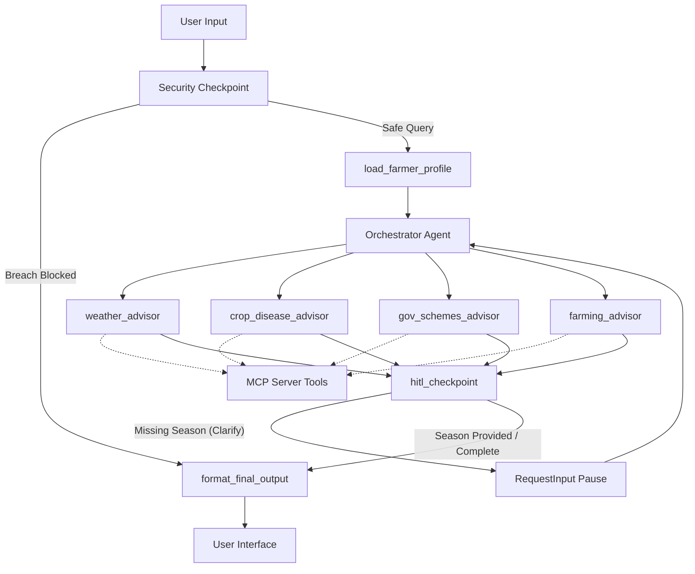
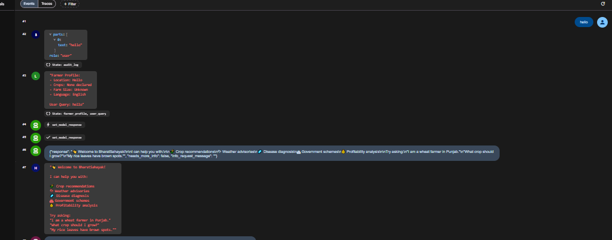
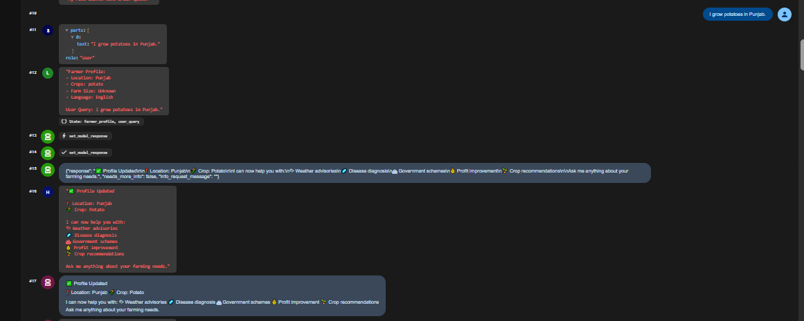
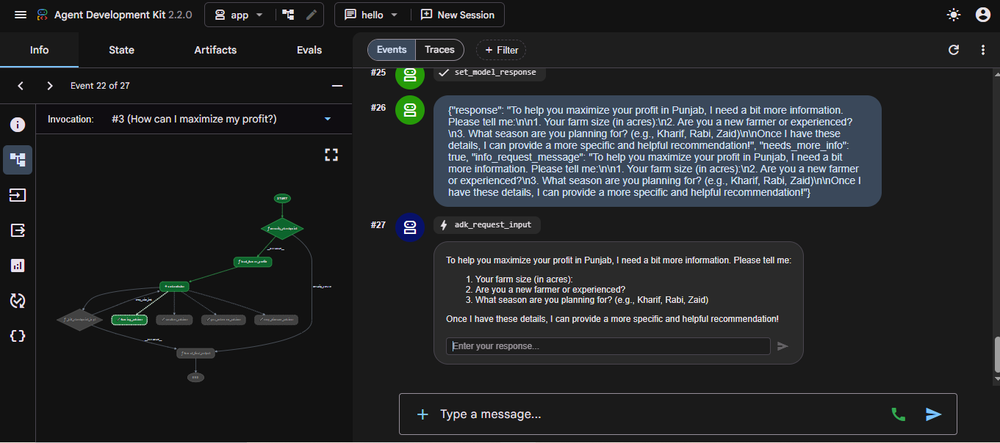
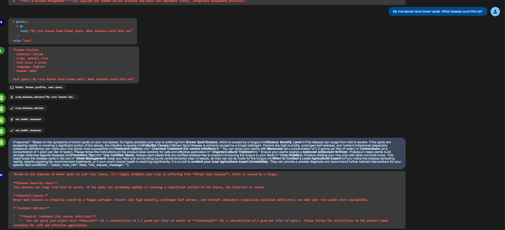
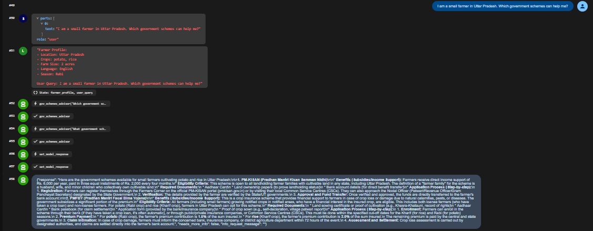
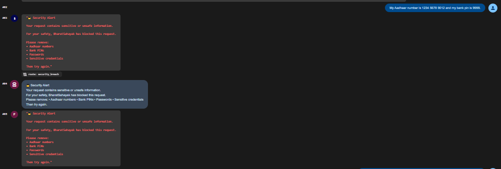
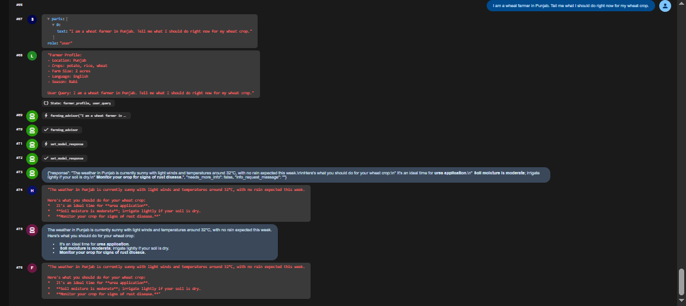
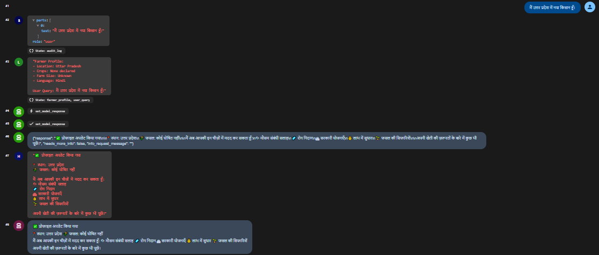

# 🌾 BharatSahayak — AI Rural Farming Companion

> **Empowering Indian Farmers with Personalized Multi-Agent Agricultural Intel, Language Inclusivity, and Safety-First Guardrails.**

---

[](https://www.kaggle.com/)
[](https://deepmind.google/technologies/gemini/)
[](https://google.github.io/adk-docs/)

---

## 📖 Project Overview

**BharatSahayak** is an AI-powered multilingual farming assistant designed to provide personalized agricultural advisory services to Indian farmers. Built on **Google's ADK 2.0 (Agent Development Kit)** and powered by **Gemini 2.5 Flash**, BharatSahayak bridges the gap between scientific agricultural research and ground-level farming operations. By acting as a multilingual, safety-conscious companion, it delivers region-specific crop recommendations, real-time weather advisories, governmental subsidy guidance, and crop disease diagnosis.

## 🎯 Hackathon Track

**Track:** Agents for Good

BharatSahayak was developed for the Google × Kaggle **AI Agents: Intensive Vibe Coding** Capstone Project under the **Agents for Good** track. The project aims to improve access to personalized agricultural knowledge, multilingual assistance, and safe AI interactions for Indian farmers.

---

## 🚨 Problem Statement

Indian agriculture is highly fragmented, with over **140 million smallholder farmers** facing multiple critical challenges:
1. **Information Asymmetry:** Farmers lack access to timely, localized, and actionable scientific recommendations.
2. **Language Barriers:** Most agricultural portals and scientific materials are in English, whereas rural communities communicate in regional languages like Hindi, Kannada, Telugu, and more.
3. **Complex Policy Landscapes:** Discovering and applying for relevant government schemes and subsidies involves navigating complex eligibility rules.
4. **Immediate Disease Diagnosis:** Crop diseases spread rapidly, and delays in identifying pests/infections lead to severe crop losses.
5. **PII and Financial Exploitation:** Rural internet users are highly vulnerable to phishing, data leaks, and social engineering.

---

## 💡 The Solution

**BharatSahayak** addresses these pain points by offering an intuitive, conversational interface that:
*   **Maintains Stored Profiles:** Remembers the farmer's state, farm size, crops grown, and language preferences across turns.
*   **Communicates Multilingually:** Translates explanations, emojis, and layouts dynamically.
*   **Orchestrates Specialized Advice:** Uses a multi-agent system where each agent is an expert in a specific domain.
*   **Ensures Ironclad Safety:** Intercepts PII (like Aadhaar numbers) and blocks off-topic or sensitive queries (like bank PIN requests) at the runtime level.
*   **Implements Human-in-the-Loop Clarification:** Resolves ambiguities (like missing farming seasons) by pausing execution, requesting info in the farmer's language, and resuming smoothly.

---

## 🚀 Key Features

*   **Multi-Agent Coordination:** Orchestrates delegation between specialized sub-agents.
*   **Dynamic Language Preference:** Dynamically switches languages (e.g. English ⇄ Hindi) based on the latest query, preventing language persistence.
*   **Rule-Based & Generative Extraction:** Combines Python-level regex/word mappings (supporting Hindi Devanagari and English) with LLM intelligence to build and maintain the farmer's profile.
*   **Model Context Protocol (MCP) Server Integration:** Integrates LLM agents with local Python tools and live data sources.
*   **Interactive Resumability:** Uses ADK 2.0's resumption flow to pause the graph for user clarification and resume statefully.

---

## 🏗 Multi-Agent Architecture

BharatSahayak is structured as a directed workflow graph managed by the ADK runtime engine.

### Workflow Graph


### Specialized Agents
1.  **Orchestrator Agent:** The central routing hub that analyzes user queries, reads the profile, calls appropriate tool advisors, and enforces language constraints.
2.  **Farming Advisor:** Recommends region-specific crops, estimates investment cost/net profits per acre, and lists practical next steps.
3.  **Weather Advisor:** Pulls live weather forecasts and translates meteorological data into actionable advice (e.g., watering schedules or fertilizer timing).
4.  **Government Schemes Advisor:** Matches eligibility parameters to local/national agricultural programs and subsidies.
5.  **Crop Disease Advisor:** Diagnoses fungal/bacterial infections from descriptions and details chemical/organic remedies.

---

## 🔌 MCP Server Tools

Agents call tools hosted on a local **Model Context Protocol (MCP) Server** running over standard input/output (`stdio`):
*   `calculate_farming_profitability(location, crops, farm_size_acres)`: Performs calculations for estimated crop yield, investment, and net profit.
*   `get_weather_advisory(location)`: Fetches current temperature, forecast conditions, and crop-specific alerts.
*   `search_government_schemes(location, crops)`: Performs indexed lookup for national (PM-KISAN, PMFBY) and state-specific agricultural schemes.
*   `get_crop_disease_info(symptoms)`: Queries a disease knowledge database for severity, causes, organic treatments, and chemical remedies.

---

## 🔒 Security Features

BharatSahayak implements a strict **Security Checkpoint** node at the very beginning of the workflow:
*   **PII Scrubbing:** Automatically scrubs Aadhaar numbers, mobile numbers, and emails using regular expressions, replacing them with redaction tags (e.g. `[AADHAAR_REDACTED]`).
*   **Safety Blocking:** Blocks sensitive inputs (such as bank PINs, passwords, or credentials) and off-topic instructions, returning a user-friendly guardrail message.
*   **Audit Logging:** Logs safety triggers and metadata to `sys.stderr` for system administrators.

---

## 👥 Human-in-the-Loop (HITL) Behavior

If a user requests crop recommendations but has not specified a farming season (**Kharif**, **Rabi**, or **Zaid**):
1.  The workflow intercepts the query at `hitl_checkpoint`.
2.  It halts execution and yields a `RequestInput` containing a clarification prompt in the user's detected language.
    *   **Hindi example:**
        > 🌾 सर्वोत्तम फसल की सिफारिश करने के लिए कृपया बताइए कि आप किस मौसम में खेती करना चाहते हैं:
        > • खरीफ
        > • रबी
        > • ज़ायद
3.  Once the user responds (e.g., `"Kharif"`), the ADK engine statefully resumes the graph from where it paused.
4.  The system stores the season in `profile.season` and proceeds to generate the tailored recommendation without overwriting other stored profile parameters like the farmer's location.

---

## 📚 Course Concepts Demonstrated

BharatSahayak was developed by applying several concepts covered in the Google & Kaggle Vibe Coding Agents course.

| Course Concept | Implementation in BharatSahayak |
|----------------|---------------------------------|
| Agent / Multi-Agent System (ADK) | Implements an orchestrated multi-agent architecture consisting of an Orchestrator Agent and specialized Farming, Weather, Government Schemes, and Crop Disease advisors. |
| Model Context Protocol (MCP) Server | Uses a local MCP Server to expose agricultural tools for profitability estimation, weather advisories, government scheme retrieval, and crop disease information. |
| Antigravity IDE | Utilized for project scaffolding, iterative development, testing, and rapid prototyping of agent workflows. |
| Security Features | Implements privacy and safety guardrails including PII redaction, prompt injection detection, credential blocking, and audit logging. |
| Human-in-the-Loop (HITL) | Requests missing information (such as farming season) and resumes execution statefully. |
| Agent Skills & Tool Usage | Demonstrates workflow orchestration, session management, custom tool integration, and agent-to-tool interactions using ADK and Agents CLI. |
| Deployability & Reproducibility | Provides documented local setup instructions and reproducible execution using the ADK Playground and standard Python tooling. |

## 🛠 Technologies Used

*   **Runtime Framework:** [Google ADK (Agent Development Kit) 2.0](https://google.github.io/adk-docs/)
*   **LLM Model:** Gemini 2.5 Flash (`gemini-2.5-flash`)
*   **Language:** Python 3.13
*   **Data Validation:** Pydantic v2
*   **Environment & Package Manager:** `uv`
*   **Web Host / Playground:** FastAPI / Uvicorn / ADK Dev Tools Server

---

## 💻 Installation Instructions

### Prerequisites
*   Python 3.11 – 3.13 (recommended 3.13)
*   `uv` package manager (install via `pip install uv` or `curl -sSf https://rye.astral.sh/get | sh`)
*   A Gemini API Key (get one from [Google AI Studio](https://aistudio.google.com/apikey))

### Steps
1.  **Clone the repository:**
    ```bash
    git clone https://github.com/Kushagra-Dixit-0906/bharatsahayak.git
    cd bharatsahayak
    ```
2.  **Set up environment variables:**
    Copy the example configuration file:
    ```bash
    cp .env.example .env
    ```
    Edit `.env` and fill in your Gemini API key:
    ```env
    GOOGLE_API_KEY=AIzaSyYourGeminiApiKeyHere
    GOOGLE_GENAI_USE_VERTEXAI=False
    GEMINI_MODEL=gemini-2.5-flash
    ```
3.  **Install dependencies:**
    ```bash
    uv pip install -e .
    ```

---

## 🏃 Running Locally

To launch the interactive **ADK Playground** developer UI (which serves a chat interface and displays real-time execution traces of the workflow graph):

```bash
uv run adk web app --host 127.0.0.1 --port 18081 --reload_agents
```

Open your browser and navigate to:
👉 **[http://127.0.0.1:18081](http://127.0.0.1:18081)**

---

## 📂 Project Structure

```text
bharatsahayak/
├── app/
│   ├── __init__.py
│   ├── agent.py                 # Multi-agent workflow, orchestration, memory & HITL logic
│   ├── config.py                # Configuration and environment settings
│   ├── mcp_server.py            # MCP Server exposing agricultural tools
│   └── main.py                  # Application entry point
│
├── tests/
│   ├── unit/                    # Unit tests
│   └── integration/             # Integration and workflow tests
│
├── assets/                      # Banner, architecture diagrams and project graphics
│
├── Screenshots/                 # Demo screenshots used in the documentation
│
├── .env.example                 # Sample environment configuration
├── pyproject.toml               # Project dependencies and build configuration
├── README.md                    # Project documentation
└── DEMO_SCRIPT.txt              # Demo presentation script
```
## 🖼 Screenshots

### 👋 Welcome Screen



*The application welcomes farmers and introduces the available AI-powered agricultural services.*

---

### 🧠 Farmer Profile Memory



*BharatSahayak automatically extracts and remembers farmer information such as location, crop, language, and farm details throughout the conversation.*

---

### 💰 Profitability Advisor with Human-in-the-Loop

**Step 1 – Farmer asks how to increase profit**


*The farmer asks for profitability advice. The orchestrator analyzes the request and determines that additional information is required.*

**Step 2 – Human-in-the-Loop Clarification**



*Execution pauses and BharatSahayak requests the missing farming information before continuing.*

**Step 3 – Personalized Recommendation**


*After receiving the required information, the workflow resumes and provides personalized profitability recommendations.*

---

### 🌿 Crop Disease Diagnosis

**Diagnosis**



*The Crop Disease Advisor identifies the disease using the specialized agricultural agent.*

**Treatment Recommendation**


*The system recommends treatments, preventive measures, and next steps for the farmer.*

---

### 🏛 Government Scheme Advisor

**Eligible Schemes**



*BharatSahayak recommends relevant government schemes based on the farmer's profile.*

**Detailed Benefits**


*The agent explains eligibility, benefits, and application guidance to help farmers access government support.*

---

### 🔒 Security Checkpoint



*Sensitive information such as Aadhaar numbers and unsafe requests are detected and blocked before reaching the agent workflow.*

---

### 🌦 Weather Advisory



*The Weather Advisor provides localized farming recommendations using weather information through the MCP Server.*

---

### 🌐 Multilingual (Hindi) Support



*BharatSahayak supports multilingual conversations and Human-in-the-Loop interactions in Hindi, making the platform accessible to more farmers.*

---

## 🎥 Demo Video

🎥 **[Watch the BharatSahayak Pitch and Demo on YouTube](https://youtu.be/uLZ2N7wl5yI?si=8I_e4h2HMMKCeBNV)**

---

## 🔮 Future Improvements

1.  **Multimodal Pest Diagnosis:** Allow farmers to upload photos of infected crop leaves for the Crop Disease Advisor to diagnose directly via computer vision.
2.  **Voice Interaction (Speech-to-Text & Text-to-Speech):** Integrate regional voice engines (supporting Hindi, Kannada, Telugu speech) to make the assistant accessible to illiterate or elderly farmers.
3.  **Offline Edge Syncing:** Implement localized database syncing to allow basic query routing and cached weather forecasting when network connectivity in remote fields is unstable.
