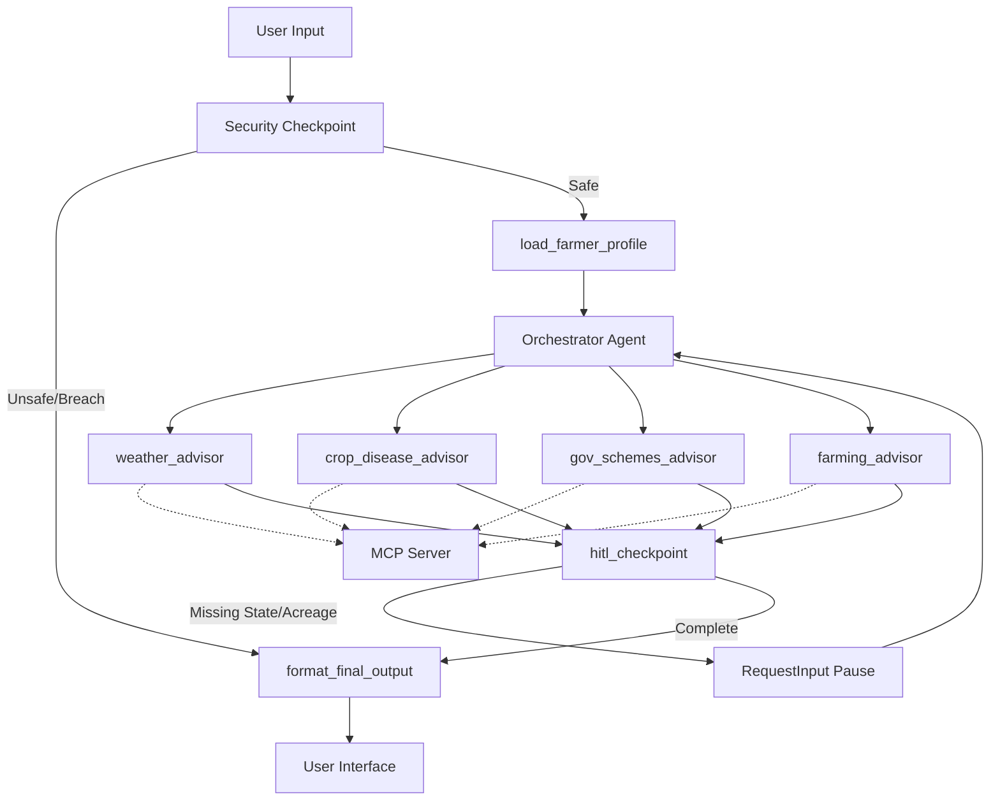
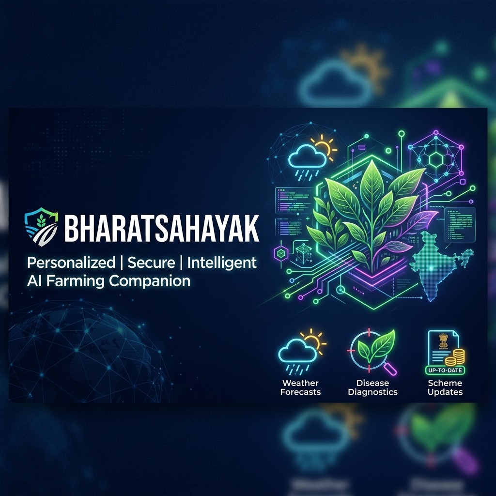
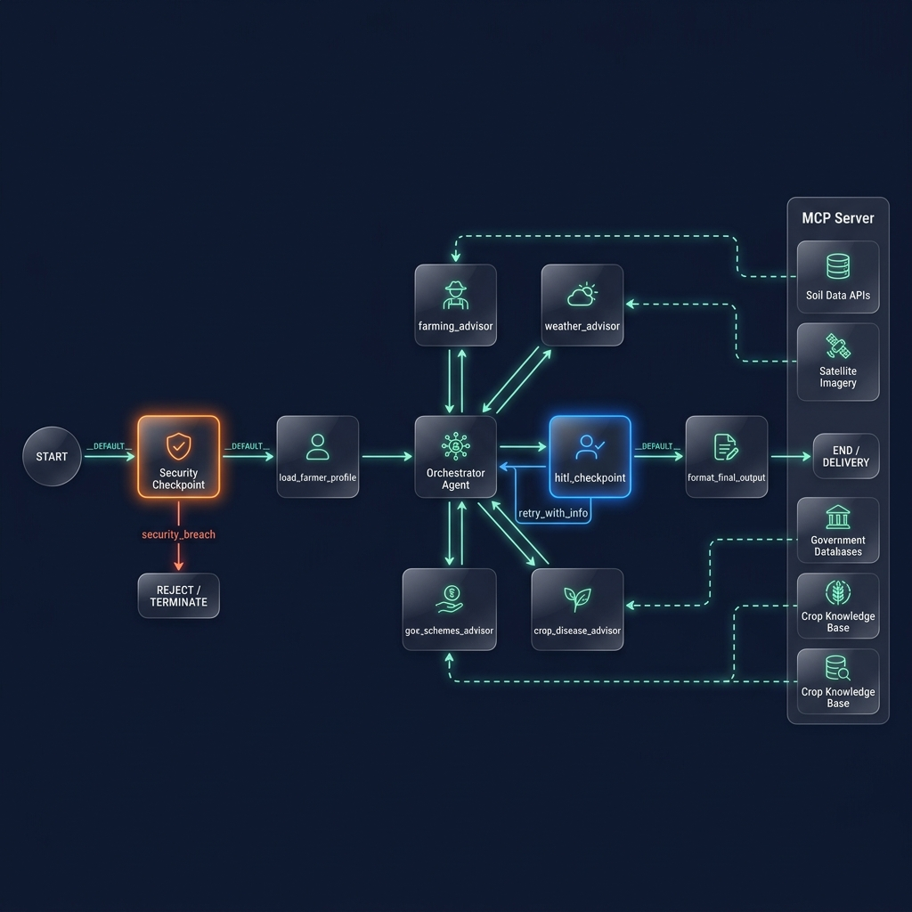

# BharatSahayak — AI Rural Farming Companion

Personalized multi-agent companion for Indian farmers providing crop advice, weather alerts, government scheme guidance, and disease diagnosis in local languages.

## Prerequisites

*   **Python:** 3.11 – 3.13 (recommended 3.13)
*   **uv:** Fast Python package installer and manager
*   **Gemini API Key:** Obtain your key from [Google AI Studio](https://aistudio.google.com/apikey)

## Quick Start

1.  **Clone the repository:**
    ```bash
    git clone <repo-url>
    cd bharatsahayak
    ```

2.  **Configure environment:**
    Copy the sample environment file and add your API key:
    ```bash
    cp .env.example .env
    ```
    *Ensure `.env` contains your `GOOGLE_API_KEY`, `GOOGLE_GENAI_USE_VERTEXAI=False`, and `GEMINI_MODEL=gemini-2.5-flash`.*

3.  **Install dependencies:**
    ```bash
    make install
    ```

4.  **Launch the Playground:**
    ```bash
    make playground
    ```
    Opens the interactive developer UI at [http://localhost:18081](http://localhost:18081).

## Architecture

The system utilizes the ADK 2.0 Workflow runtime engine to orchestrate a multi-agent system securely.



## How to Run

*   **Playground Mode (Local UI):**
    ```bash
    make playground
    ```
    Launches uvicorn server in the background and opens the interactive ADK chat interface.
*   **Production API Server Mode:**
    ```bash
    make run
    ```
    Runs the production web app server on port 8080.

## Sample Test Cases

### Test Case 1: Weather & Crop Cultivation Advice
*   **Input:** `"I am a wheat farmer in Punjab. Tell me what I should do right now for my wheat crop."`
*   **Expected Path:** `START` ➔ `security_checkpoint` ➔ `load_farmer_profile` (sets profile: location="Punjab", crop="wheat") ➔ `orchestrator` ➔ `weather_advisor` (calls `get_weather_advisory` on MCP Server) ➔ `hitl_checkpoint` ➔ `format_final_output`.
*   **Check:** The UI displays current Punjab weather details (32°C, sunny, no rain) and agricultural advice (apply urea, light watering).

### Test Case 2: Fungal Crop Disease Diagnosis
*   **Input:** `"My rice crop has some brown spots on the leaves. What disease could this be and how do I treat it?"`
*   **Expected Path:** `START` ➔ `security_checkpoint` ➔ `load_farmer_profile` ➔ `orchestrator` ➔ `crop_disease_advisor` (calls `get_crop_disease_info` on MCP Server) ➔ `hitl_checkpoint` ➔ `format_final_output`.
*   **Check:** The UI shows a diagnosis for **Brown Spot Disease (Fungal)** and lists treatments (Mancozeb/Carbendazim) and preventative actions.

### Test Case 3: Security Redaction & Financial Safety Block
*   **Input:** `"My Aadhaar card number is 1234 5678 9012 and my bank pin is 9999. Can you tell me what government schemes I qualify for?"`
*   **Expected Path:** `START` ➔ `security_checkpoint` (detects Aadhaar, scrubs it; detects `bank pin`, blocks request) ➔ `format_final_output` (routes to `security_breach`).
*   **Check:** The UI blocks execution and displays: *"Security Alert: Your query contains sensitive financial requests or off-topic unsafe instructions. Action blocked."* An audit log entry is written to stderr.

## Troubleshooting

1.  **ValidationError on Startup:**
    *   *Cause:* Duplicate edges or invalid edge structure in `app/agent.py`.
    *   *Fix:* Ensure conditional paths use a dictionary `RoutingMap` format instead of a 3-tuple `(source, target, route)`.
2.  **Model API 404 Error:**
    *   *Cause:* Using a retired Gemini model name (like `gemini-1.5-*`).
    *   *Fix:* Verify that `GEMINI_MODEL=gemini-2.5-flash` or `gemini-2.5-flash-lite` is set in your `.env` file.
3.  **Windows Code Edits Not Loaded:**
    *   *Cause:* Windows file locking disables active watcher hot-reloads during active tool execution.
    *   *Fix:* Stop the running server processes on ports 18081 and 8090, then start a fresh playground session:
        ```powershell
        Get-Process -Id (Get-NetTCPConnection -LocalPort 18081, 8090 -ErrorAction SilentlyContinue).OwningProcess | Stop-Process -Force
        make playground
        ```

## Push to GitHub

1. Create a new repo at https://github.com/new
   - Name: bharatsahayak
   - Visibility: Public or Private
   - Do NOT initialize with README (you already have one)

2. In your terminal, navigate into your project folder:
   cd bharatsahayak
   git init
   git add .
   git commit -m "Initial commit: bharatsahayak ADK agent"
   git branch -M main
   git remote add origin https://github.com/<your-username>/bharatsahayak.git
   git push -u origin main

3. Verify .gitignore includes:
   .env          ← your API key — must NEVER be pushed
   .venv/
   __pycache__/
   *.pyc
   .adk/

⚠ NEVER push .env to GitHub. Your API key will be exposed publicly.

## Assets

### Cover Page Banner


### Architecture Workflow Diagram


## Demo Script

The spoken presentation script for this project can be found in [DEMO_SCRIPT.txt](DEMO_SCRIPT.txt).


