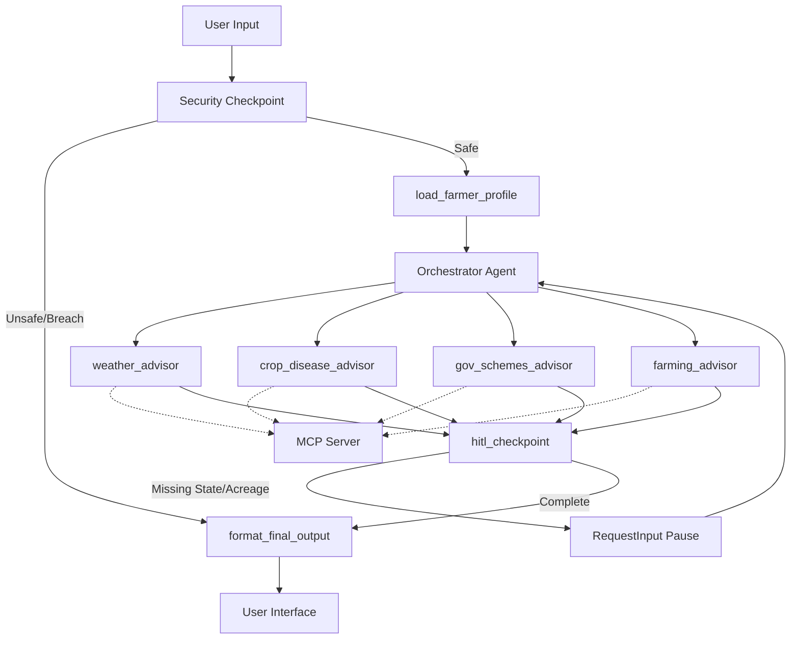

# BharatSahayak — Project Submission Write-Up

## Problem Statement
Agriculture is the backbone of the Indian economy, employing over 50% of the population. However, smallholder and rural farmers face critical information gaps. Modern farming advice, dynamic weather alerts, and government subsidies/schemes are often locked in complex databases, PDF bulletins, or require technical navigation. 

BharatSahayak solves this by acting as an AI Rural Farming Companion. It translates agricultural datasets and tools into a simple, personalized, multilingual dialogue interface that remembers the farmer's location, crop choices, and land details.

## Solution Architecture

## Concepts Used (ADK & MCP Tools)

*   **ADK Multi-Agent Workflow:** Orchestrates deterministic graph transitions using `Workflow` and `START` primitives defined in [agent.py](file:///d:/Documents/Desktop/adk-workspace/bharatsahayak/app/agent.py#L354-L373).
*   **LlmAgent & AgentTool:** The core orchestrator LlmAgent utilizes `AgentTool` to route requests to specialized sub-agents (`farming_advisor`, `weather_advisor`, `gov_schemes_advisor`, `crop_disease_advisor`) as defined in [agent.py](file:///d:/Documents/Desktop/adk-workspace/bharatsahayak/app/agent.py#L49-L133).
*   **MCP Server (Model Context Protocol):** Developed a standalone service in [mcp_server.py](file:///d:/Documents/Desktop/adk-workspace/bharatsahayak/app/mcp_server.py) using the MCP Python SDK to expose domain-specific tools.
*   **McpToolset Integration:** Connected the local stdio MCP server to all four specialized agents via `McpToolset` in [agent.py](file:///d:/Documents/Desktop/adk-workspace/bharatsahayak/app/agent.py#L25-L33).
*   **Security Checkpoint:** Implemented a robust security interceptor in [agent.py](file:///d:/Documents/Desktop/adk-workspace/bharatsahayak/app/agent.py#L137-L232) that sanitizes inputs and manages safety thresholds.
*   **Agents CLI:** Managed using `agents-cli` for template bootstrapping, virtual environment sync, and local testing.

## Security Design

1.  **PII Scrubbing:** Redacts Aadhaar numbers, mobile phone numbers, and emails using regex to prevent exposing sensitive details to LLM APIs.
2.  **Prompt Injection Guard:** Intercepts system keyword instructions (e.g. "ignore previous instructions") and aborts execution to prevent jailbreaking.
3.  **Audit Logs:** Generates structured JSON logs printed to `sys.stderr` and persisted in `ctx.state["audit_log"]` on every query transaction for auditing.
4.  **Financial & Sabotage Filters:** Custom filters block extraction of sensitive bank/credit credentials and deny generation of harmful/malicious farming sabotage recipes.

## MCP Server Design

*   `get_weather_advisory`: Returns location-based weather reports and custom advice on irrigation schedules or crop safety.
*   `get_crop_disease_info`: Diagnoses fungal/bacterial diseases from symptoms (such as brown leaf spots) and details cures and prevention.
*   `search_government_schemes`: Matches regional government assistance programs (like PM-KISAN or Krishi Bhagya) to a farmer's state.
*   `calculate_farming_profitability`: Computes estimated sowing costs, MSP revenues, and net profits for crop acreages.

## Human-in-the-Loop (HITL) Flow
Agricultural advice depends heavily on context. If a user asks for government schemes or profitability without declaring their location or land size, the orchestrator triggers `needs_more_info`. The `hitl_checkpoint` node pauses execution using `RequestInput(interrupt_id="more_info")` and waits for user clarification. 

Once the user provides the missing details, the system saves the preferences to the profile state and automatically re-runs the orchestrator to provide tailored guidance.

## Demo Walkthrough
Refer to the three test cases in the [README.md](file:///d:/Documents/Desktop/adk-workspace/bharatsahayak/README.md#L45-L75):
1.  **Weather Query:** Demystifies crop-weather planning by pulling local weather factors.
2.  **Disease Query:** Acts as an instant field expert, identifying diseases like Brown Spot in rice.
3.  **PII/Threat Block:** Demonstrates critical security blocking when private bank details or malicious prompts are sent.

## Impact & Value
BharatSahayak lowers the entry barrier for modern agriculture, supporting both traditional rural farmers and new agri-entrepreneurs. It delivers actionable, secure, and context-aware farming knowledge directly to communities, leading to optimized resource use, cost reductions, and increased yields.
